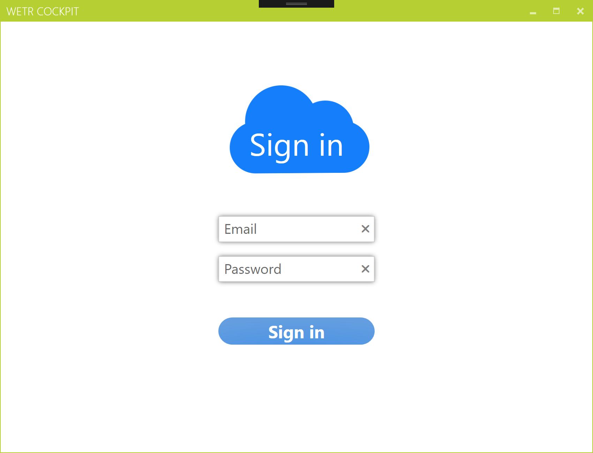
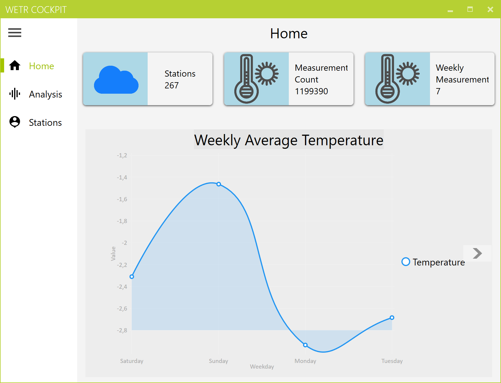
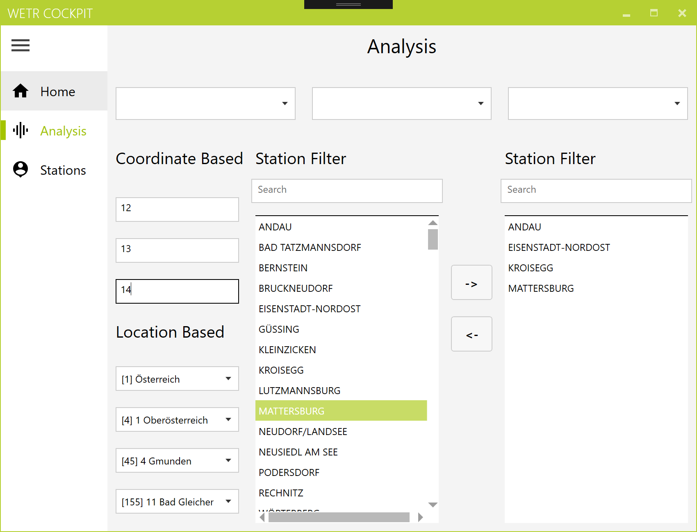
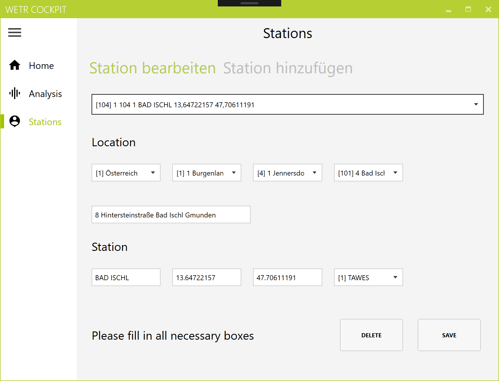
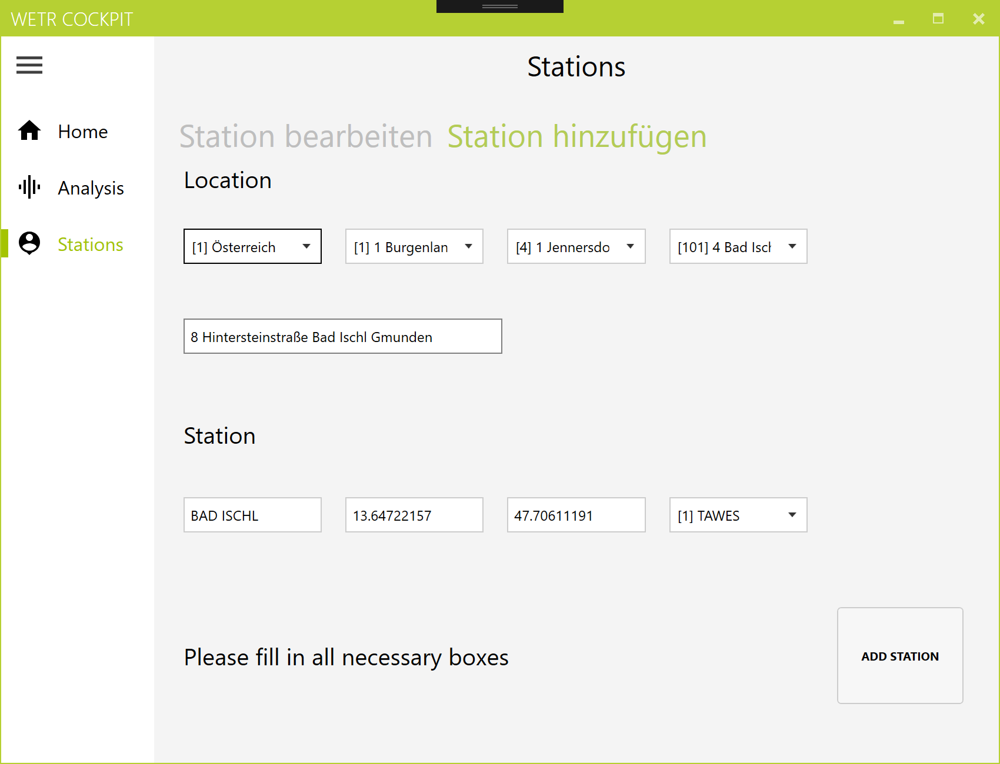
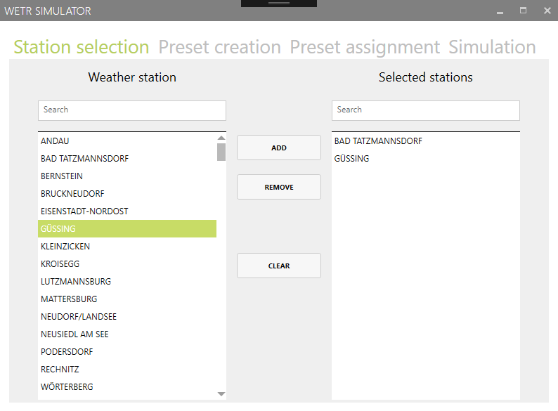
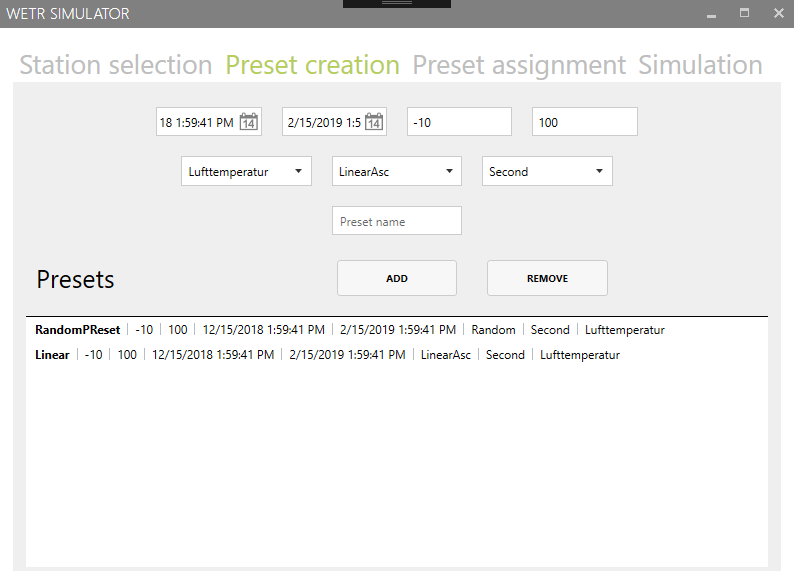
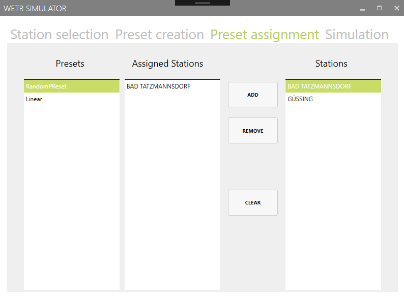
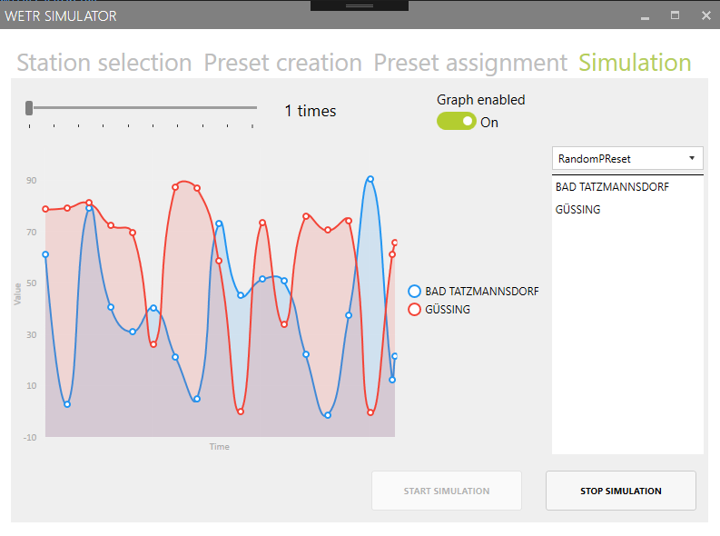

<h1 align="center">
  <!---->
   
  WeatherTracer - wetr [ˈwetər]
   
  - Archived -.

  
</h1>

# Preface

This project is archived and is for future reference only.

# Project Overview

A system for visualizing local weather data using a WPF application.

**Developers:**

* English Daniel
* Roither Andreas

The documentation of this project can be found in the `docs/` directory (german only).

# Showcase

## Cockpit

Login          |  Dashboard
:-------------------------:|:-------------------------:
  |  

Analysis          |  Stations
:-------------------------:|:-------------------------:
  |  

  

## Simulator

Station Selection          |  Preset Creation
:-------------------------:|:-------------------------:
  |  

Preset Assignment          |  Simulation
:-------------------------:|:-------------------------:
  |  

## Technology used

IDE:  
[Visual Studio](https://www.visualstudio.com/)  

Other tools/libraries:  
[Python](https://www.python.org/)  
[Docker](https://www.docker.com/)  
[MahApps.Metro](https://github.com/MahApps/MahApps.Metro)  
[WPF](https://docs.microsoft.com/en-us/dotnet/desktop/wpf/overview/)

## Specification

There are numerous websites and mobile applications that offer weather forecasts far into the future.
far into the future. These forecasts are not always reliable, as they are based on a relatively small number of weather stations.
(and a long-term forecast is associated with great uncertainties). Due to the geographical structure of Austria, the weather in our country sometimes shows great regional differences.
This is another factor that makes a weather forecast in Austria very difficult.

The basis for any weather forecast is data from as dense a network of weather stations as possible.
Not only official bodies such as the Central Institute for Meteorology and Geodynamics operate weather stations, but also an increasing number of private individuals have simple radio stations that can provide weather data via a network connection.
which can provide weather data via a network connection.

Within the framework of this project work, an application is to be developed that can take data from many weather stations, evaluate them statistically and visualise the results in a graphically appealing way. Although this data forms the basis for a weather forecast, this functionality is not part of this project.
part of this project work.

## Functional requirements

Within the scope of this project work, the software system for managing the master data of weather stations and the measurement data sent by these stations is to be developed. The station and weather data
are to be stored in a central database, weather data have to be statistically evaluated and visualised. The software system consists of the following components:

* **Wetr.Server**  
is the central component for data management. Wetr.Server also has a flexible and efficient query component, which offers possibilities for data filtering and data cumulation.
* **Wetr.WebService**  
exports all of Wetr.Server's functionality in the form of a web service that has two endpoints. One endpoint allows Wetr.Web to communicate with the server. Weather data can be fed into the system via the second endpoint.
* **Wetr.Cockpit**  
is used to display the current weather situation and to visualise the longer-term development of weather data. With appropriate rights, the master data of the weather stations can be maintained (add, update, delete).
* **Wetr.Web**  
The web client also displays the current weather situation, offers options for visualising historical weather data and has limited functionality for the administration of weather stations.
* **Wetr.Simulator**  
With this component, weather data can be generated automatically and transferred to Wetr.Server.

### (a) Data model

The following defines the essential attributes of the main entities of the system. From the additional entities and further properties of the listed entities may result from the requirements specification, entities listed, which are to be supplemented accordingly.

#### (a.1) Station

For each weather station, the name, the station type (make, etc.), the address, and its geo-coordinates (l.c.) are defined.
and its geo-coordinates (longitude and latitude) shall be stored. The postcode defines
the assignment of the station to a municipality and thus also the assignment to a district and a federal state.

#### (a.2) Community/District/Province

In these entities the master data of the communities, districts
and provinces are stored. This data is accessed on a read-only basis. The administration of this data is not part of this project.

#### (a.3) User

This entity is used to manage the access data of users who are allowed to change the master data of a ward.
change the master data of a station.

#### (a.4) Measurement

A measurement contains different weather data, such as air temperature, air pressure, rainfall, humidity, wind speed, wind direction. Each measurement contains a measured value and a time stamp. Measurement attributes must be assigned a unit (degrees Celsius, km/h etc.) must be assigned to measurement attributes. Weather data is expected to be reported irregularly and with varying frequency.

### (b) Wetr.Server

The server component provides the central functionality for the clients.

#### (b.1) Master data management

The server component shall provide a suitable interface to manage the weather stations (add, delete, modify).

#### (b.2) Management of measurement data

The weather data is the main transaction data of the system. A function to add a new measurement data set shall be provided. Measurement data is always associated with a weather station.

#### (b.3) Queries

The query component is the core module of the server. The query module shall provide possibilities for data accumulation and filtering of weather data:

* Filtering by weather station or region: a region is defined by a point and a radius, but can also be a municipality, a district or a state.
* Data cumulation for certain time intervals (hour, day, week, month): Data cumulation can mean minimum, maximum, averaging but also summation of the measured values. Here are some examples of queries that this component should support:
* What was the average/minimum/maximum temperature at a particular weather station/region grouped by days/week/months?
* What was the daily/weekly/monthly cumulative rainfall at a particular weather station?
* What was the average amount of precipitation in a given region grouped by days/weeks/months?

#### (b.4) Measurement data analysis

A simple evaluation component is to be created with which warnings about currently occurring weather phenomena can be given via Twitter at regular intervals. These include, for example, heavy rain, storms or freezing rain. In addition to the phenomenon itself, the weather warning should also include the region.

### (c) Wetr.WebService

The functionality required for Wetr.Web and Wetr.Simulator is to be exported in the form of a REST-based web service. Access to the web service does not need to be secured.

### (d) Wetr.Simulator

The weather simulator has the task of randomising the measured data supplied by the weather stations in real operation.
and feed it into the system via the REST interface provided for this purpose. The simulator can simulate measured values in a predefined time range, which can also be in the past, and has a time-lapse function for accelerated generation of data.
accelerated generation of data. You can use the simulator to demonstrate the robustness
robustness and performance of the implementation.

#### (d.1) Add/remove a weather station

It must be possible to select a station from the list of available weather stations and add it to the simulator. Since the simulator must support multiple weather stations, this process must be repeatable as often as required. The deletion of a weather station shall also be provided for.

#### (d.2) Simulation settings

For a simulation run, the simulated weather station, the simulation date and time (start and end) and the simulation speed (e.g. half speed, real speed, 10 times speed) must be specified. Use appealing controls (combo box, date selector, slider, etc.).

#### (d.3) Configuration of measurement sequences

A measurement sequence is a set of related measurement values over a certain period of time (e.g. course of temperature at a certain weather station over a day). Several measurement sequences are to be simulated per weather station.
It must be possible to set the following parameters for each measurement sequence:

* measured value to be simulated (e.g. temperature, air pressure, etc.)
* Frequency at which new data is to be generated (e.g. every 10 s)
* Value range (from/to) for the generated values
* Strategy for distribution
  * linear increase/decrease between from and to
  * random value between from and to
  * at least one freely selectable additional strategy, which can simulate any
  
(e.g. temperature distribution over the day, increasing and decreasing rainfall, etc.).
Generate measurement sequences that are as realistic as possible. Note that a measured value is not completely independent of the preceding value. The temperature, for example, will not
temperature, for example, will not take on completely random values in a certain numerical range over a short period of time.

#### (d.4) Controlling the simulation

The simulation can be started and stopped. This starts or stops the generation of measured values. The user interface must be responsive during the simulation to be able to stop a simulation at any time.

#### (d.5) Changing the simulation speed

The simulation speed can be changed during a running simulation and has an immediate effect.

#### (d.6) Display of weather stations

The current measured values of the weather stations as well as the measured data history must be presented in a graphically appealing way. Real weather stations can serve as an orientation aid. The simulated weather stations should be clearly separated from each other visually (e.g. divided into tabs or similar).

#### (d.7) Load simulation

In the simulator, the generation of measured values for a larger number of weather stations can be triggered. The resulting measured value sequences do not have to be displayed graphically. It is up to you which parameters you configure for this application.

### (e) Wetr.Cockpit

Wetr.Cockpit is a client that is mainly used by specialists (meteorologists). This component has two main functionalities: the editing of weather stations and the analysis of weather data.
of weather data.

#### (e.1) Administration of weather stations

New weather stations can be entered, edited and deleted (see (b.1)). Deleting a weather station should only be possible if no measurement data are available for this weather station.

#### (e.2) Weather analyses

As described in (b.3), it should be possible to perform queries based on the recorded weather data. The user must be able to enter the required query parameters, such as filter conditions and parameters for grouping the data, in a clear manner.
way. Use the functionality described in (b.3) as a guide.
The result of a query must be displayed in graphical form. The use of an
existing chart component is recommended.
One-teams can limit themselves to a tabular representation of the data.
Particular care must be taken to ensure that during the execution of a query - which can take a long time - the user interface is not interrupted.
time - the user interface is not blocked.

### (f) Wetr.Web

With the help of this client, users can get an overview of the current weather situation.
weather situation. Among other things, it is important that users can keep a preference list in which they can enter weather stations and thus follow the weather development at several locations. In principle, the user interface should be easy to use and visually appealing.
visually appealing implementation. For a good example, see <https://www.wunderground.com/>.

#### (f.1) Public search

Users should be able to search for weather data for a specific location. The results should be displayed both graphically (e.g. using charts) and in tabular form. Make sure that the display is as clear as possible. Allow users to show and hide details (e.g. station type) of weather stations.

#### (f.2) Visualisation

Display the weather data in different ways, e.g. hourly weather data, daily summary with lowest and highest value and hourly temperature curve. Also display statistics on the individual measured data (graphically and in tabular form). Allow the user to customise them (time range, location, etc.).

#### (f.3) Login

A user should be able to log in. A special bonus here would be the use of OAuth and OpenID.

#### (f.4) Custom View / Manage Preferences

Users should be able to create their own "weather dashboard". The preferences (e.g. temperature unit,
weather stations) should be managed/saved in the browser (local storage) beyond the user session. Users can choose the weather stations to be displayed based on a search function. Also give the users the possibility to choose the type of
(e.g. hourly weather data, daily summary, etc.) and store these settings so that the next time
save these settings so that the user-defined dashboard is displayed again the next time the user logs in.
is displayed again.

#### (f.5) Manage own weather stations and enter own weather data

Create a way for registered users to manage their own weather stations and enter weather data. However, this should only be allowed for authenticated users. We want to ensure that only high-quality data is entered into the database.
